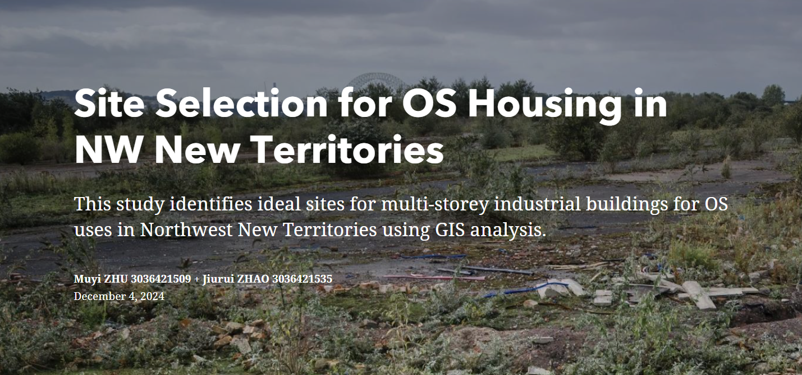

# Data Visualization

This repository showcases two data analysis results presented as interactive ArcGIS StoryMaps. Each project combines narrative text with interactive maps and multimedia content to provide an engaging exploration of the topics.

## Projects

### 1. When My Picky Friend Is Coming to Hong Kong

This StoryMap offers a comprehensive guide for hosting a discerning friend visiting Hong Kong. It highlights various attractions, dining options, and cultural experiences tailored to impress even the most selective visitors.

*Explore the StoryMap: [When My Picky Friend Is Coming to Hong Kong](https://storymaps.arcgis.com/stories/c078aced71ec4fec8df26fbdca7fbe63)*

---

### 2. Site Selection for OS Housing in NW New Territories

This project analyzes potential sites for public housing development in the Northwestern New Territories. It evaluates various factors such as accessibility, environmental impact, and land availability to recommend optimal locations for housing projects.

*Explore the StoryMap: [Site Selection for OS Housing in NW New Territories](https://storymaps.arcgis.com/stories/969f907761bf414d9cc9bae9a515d22e)*

---

## How to View

Click on the images or the links above to access the interactive StoryMaps. Each StoryMap provides an immersive experience with detailed narratives and interactive maps.

---
